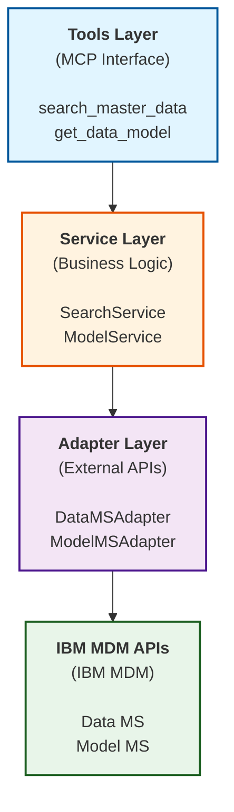

<!--
This file has been modified with the assistance of IBM Bob (AI Code Assistant)
-->

# IBM MDM MCP Server

[](https://opensource.org/licenses/Apache-2.0)
[](https://www.python.org/downloads/)
[](https://modelcontextprotocol.io)

A [Model Context Protocol (MCP)](https://modelcontextprotocol.io) server that provides AI assistants with seamless access to IBM Master Data Management (MDM) services through standardized REST API interactions.

## 🎯 Overview

This MCP server enables AI assistants like Claude to interact with IBM MDM services(formarly known as IBM Match 360), allowing users to search records, retrieve data models, and manage master data through natural language conversations. The server acts as a bridge between AI assistants and IBM MDM, exposing enterprise data management capabilities through the Model Context Protocol.

### Key Features

- 🔌 **MCP Protocol Support** - Standard interface for AI assistant integration
- 🌐 **Multi-Platform** - Supports IBM MDM SaaS on IBM Cloud and IBM MDM on Software Hub
- 🔐 **Secure Authentication** - Token-based authentication with automatic caching
- 🛠️ **Flexible Tool Modes** - Minimal or full tool exposure based on use case
- 📊 **Type-Safe** - Built with Pydantic models for robust data validation
- 🏗️ **Clean Architecture** - Layered design with adapter pattern for maintainability

## 📋 Table of Contents

- [Prerequisites](#prerequisites)
- [Quick Start](#quick-start)
- [Manual Installation](#manual-installation)
- [Configuration](#configuration)
- [Integration with Claude Desktop](#integration-with-claude-desktop)
- [Running the Server](#running-the-server)
- [Available Tools](#available-tools)
- [Sample Queries](#sample-queries)
- [Testing](#testing)
- [Architecture](#architecture)
- [Troubleshooting](#troubleshooting)
- [Contributing](#contributing)
- [License](#license)

---

## Prerequisites

Before you begin, ensure you have:

- **Python 3.10+** - [Download here](https://www.python.org/downloads/)
- **Git** - [Installation guide](https://git-scm.com/)
- **IBM MDM Instance** - Access to IBM MDM SaaS (IBM Cloud) or IBM MDM on Software Hub with credentials ready
- **Claude Desktop** (Optional) - [Download here](https://claude.ai/download) if you want AI assistant integration

> 📖 **Need help getting started?** See the detailed [Setup Guide](docs/SETUP_GUIDE.md) for step-by-step instructions on installing prerequisites and obtaining IBM MDM credentials.

> 🔐 **Security Note (IBM Cloud only):** Generate a dedicated API key specifically for this MCP server - do not reuse existing API keys from other applications.

---

## Quick Start

**New users should use the automated setup script for the easiest installation experience.**

### One-Command Setup

**Clone the repository:**

```bash
# Option 1: HTTPS (recommended)
git clone https://github.com/IBM/mdm-mcp-server.git
cd mdm-mcp-server

# Option 2: SSH (if you have SSH keys configured)
git clone git@github.com:IBM/mdm-mcp-server.git
cd mdm-mcp-server
```
<details>

<summary> Option 3: Download ZIP (if git is not available)</summary>
1. Go to the repository: https://github.com/IBM/mdm-mcp-server
2. Click the green **Code** button
3. Select **Download ZIP**
4. Extract the ZIP file and navigate to the extracted directory
</details>
<br />

**Run the setup wizard:**

```bash
python setup_wizard.py
```

The setup wizard will guide you through:
- Virtual environment creation and dependency installation
- Platform selection (IBM Cloud or Software Hub)
- Credential configuration
- Tool mode selection (minimal or full)
- Setup mode selection (Claude Desktop or HTTP)

### Setup Options

**Interactive setup (recommended):**
```bash
python setup_wizard.py
```

**Claude Desktop integration only:**
```bash
python setup_wizard.py --claude
```

**HTTP mode only (for MCP Inspector):**
```bash
python setup_wizard.py --http
```

After setup completes:
- **For Claude Desktop**: Restart Claude Desktop to use IBM MDM tools in conversations
- **For HTTP mode**: Start server with `.venv/bin/python src/server.py` (macOS/Linux) or `.venv\Scripts\python src\server.py` (Windows)
- **Test with MCP Inspector**: Run `npx @modelcontextprotocol/inspector` (no URL needed, it will auto-detect the running server)

📖 **For detailed setup instructions and troubleshooting**, see the [Setup Guide](docs/SETUP_GUIDE.md)

---

## Manual Installation

> **Note:** Most users should use the [Quick Start](#quick-start-recommended) automated setup. Manual installation is for advanced users or custom deployments.

### Step 1: Clone the Repository

**Option 1: HTTPS (recommended)**
```bash
git clone https://github.com/IBM/mdm-mcp-server.git
cd mdm-mcp-server
```

**Option 2: SSH (if you have SSH keys configured)**
```bash
git clone git@github.com:IBM/mdm-mcp-server.git
cd mdm-mcp-server
```

**Option 3: Download ZIP (if git is not available)**
1. Go to the repository: https://github.com/IBM/mdm-mcp-server
2. Click the green **Code** button
3. Select **Download ZIP**
4. Extract the ZIP file to your desired location
5. Open a terminal and navigate to the extracted directory:
   ```bash
   cd mdm-mcp-server-main
   ```

### Step 2: Create Virtual Environment

**macOS/Linux:**
```bash
python3 -m venv .venv
source .venv/bin/activate
```

**Windows:**
```bash
python -m venv .venv
.venv\Scripts\activate
```

### Step 3: Install Dependencies

```bash
pip install -r requirements.txt
```

### Step 4: Configure Environment

Create and edit the `.env` file:

```bash
cp src/.env.example src/.env
# Edit src/.env with your credentials (see below)
```

**For IBM MDM SaaS on IBM Cloud:**
```env
M360_TARGET_PLATFORM=cloud
API_CLOUD_BASE_URL=<your_mdm_base_url>  # Example: https://api.ca-tor.dai.cloud.ibm.com/mdm/v1/ (Toronto)
API_CLOUD_AUTH_URL=https://iam.cloud.ibm.com/identity/token
API_CLOUD_API_KEY=<your_api_key>
API_CLOUD_CRN=<your_instance_crn>
MCP_TOOLS_MODE=minimal
```

**For IBM MDM on Software Hub:**
```env
M360_TARGET_PLATFORM=cpd
API_CPD_BASE_URL=<your_cpd_base_url+instance_id+mdm+v1> #Example https://cpd-xxxx.ibm.com/1767689393191029/mdm/v1/
API_CPD_AUTH_URL=<your_cpd_auth_url>
API_USERNAME=<your_username>
API_PASSWORD=<your_password>
MCP_TOOLS_MODE=minimal
```

**Tool Mode Options:**
- `minimal` (default): Exposes essential tools (`search_master_data`, `get_data_model`)
- `full`: Exposes all tools including `get_record`, `get_entity`, `get_records_entities_by_record_id`

### Step 5: Test the Server (Optional)

Verify your setup works:

```bash
# Start in HTTP mode
python src/server.py

# Server should start at http://localhost:8000
# Press Ctrl+C to stop
```

---

## Claude Desktop Integration (Manual)

If you want to use the server with Claude Desktop, follow these additional steps:

### Step 1: Find Your Python Path

With the virtual environment activated:

**macOS/Linux:**
```bash
which python
# Example output: /Users/yourname/mdm-mcp-server/.venv/bin/python
```

**Windows:**
```bash
where python
# Example output: C:\Users\yourname\mdm-mcp-server\.venv\Scripts\python.exe
```

### Step 2: Locate Claude Desktop Config

**macOS:** `~/Library/Application Support/Claude/claude_desktop_config.json`
**Windows:** `%APPDATA%\Claude\claude_desktop_config.json`

### Step 3: Add MCP Server Configuration

Edit the config file and add (replace paths with your actual paths):

**Option A: Use existing `.env` file (Recommended)**
```json
{
  "mcpServers": {
    "ibm-mdm": {
      "command": "/absolute/path/to/.venv/bin/python",
      "args": ["/absolute/path/to/mdm-mcp-server/src/server.py", "--mode", "stdio"]
    }
  }
}
```

The server will read credentials from your `src/.env` file.

**Option B: Override with environment variables**
```json
{
  "mcpServers": {
    "ibm-mdm": {
      "command": "/absolute/path/to/.venv/bin/python",
      "args": ["/absolute/path/to/mdm-mcp-server/src/server.py", "--mode", "stdio"],
      "env": {
        "M360_TARGET_PLATFORM": "cloud",
        "API_CLOUD_BASE_URL": "https://api.ca-tor.dai.cloud.ibm.com/mdm/v1/",
        "API_CLOUD_AUTH_URL": "https://iam.cloud.ibm.com/identity/token",
        "API_CLOUD_API_KEY": "<your_api_key>",
        "API_CLOUD_CRN": "<your_crn>",
        "MCP_TOOLS_MODE": "minimal"
      }
    }
  }
}
```

> **Note:** The `env` section is optional. When provided, these values take precedence over the `src/.env` file. Use this to override specific settings or manage multiple configurations.

### Step 4: Restart Claude Desktop

Restart Claude Desktop. IBM MDM tools should now appear in your conversations.

### Step 5: Verify Integration

In Claude Desktop, try asking:
```
"What IBM MDM tools are available?"
```

You should see the MDM tools listed.

## Running the Server

The server supports two operational modes:

### HTTP Mode (for Testing & Development)

Start the server as an HTTP service:

```bash
# Using virtual environment Python
.venv/bin/python src/server.py              # macOS/Linux
.venv\Scripts\python src\server.py          # Windows

# Or with activated venv
python src/server.py
```

The server starts at `http://localhost:8000` by default.

**Custom port:**
```bash
python src/server.py --port 3000
```

**Available options:**
- `--mode` or `-m`: Operation mode (`http` or `stdio`). Default: `http`
- `--port` or `-p`: Port number for HTTP mode. Default: `8000`

**Testing with MCP Inspector:**
```bash
# Start server in one terminal
python src/server.py

# In another terminal, run inspector
npx @modelcontextprotocol/inspector
```

**Stop the server:**
- Press `Ctrl+C` in the terminal, or:

```bash
# macOS/Linux
lsof -ti:8000 | xargs kill -9

# Windows
netstat -ano | findstr :8000
taskkill /PID <PID> /F
```

### STDIO Mode (for Claude Desktop)

This mode is automatically used when Claude Desktop launches the server. You don't need to run it manually.

**For testing STDIO mode manually:**
```bash
python src/server.py --mode stdio
```

> **Note:** STDIO mode is for MCP client integration (like Claude Desktop). The server communicates via standard input/output instead of HTTP.

## Available Tools

### Minimal Mode (Default)

Essential tools for common MDM operations:

| Tool | Description |
|------|-------------|
| `search_master_data` | Search for master data (records, entities, relationships, hierarchy nodes) in IBM MDM with flexible query parameters |
| `get_data_model` | Retrieve the complete MDM data model schema |

### Full Mode

All available tools including advanced operations:

| Tool | Description |
|------|-------------|
| `search_master_data` | Search for master data with advanced filtering |
| `get_data_model` | Retrieve data model schema |
| `get_record` | Retrieve a specific record by ID |
| `get_entity` | Retrieve an entity by ID |
| `get_records_entities_by_record_id` | Get all entities associated with a record |

Enable full mode by setting `MCP_TOOLS_MODE=full` in your environment configuration.

---

## Sample Queries

Want to see what you can do with this MCP server? Check out our comprehensive [Sample Queries Guide](docs/SAMPLES.md) which includes:

- 📊 **Report Templates** - Ready-to-use templates for dashboards and visualizations
- 🔄 **Common Usage Patterns** - Real-world scenarios with concrete examples
- 🎯 **Query Examples** - From basic searches to complex nested queries
- 📈 **Analytics Queries** - Distribution analysis, comparisons, and data quality reports
- 💡 **Best Practices** - Tips to prevent hallucination and ensure accurate results

**Quick Examples:**
```
"What entity types and searchable fields are available in my MDM system?"
"Find customer records where status equals active and region equals northeast"
"Create a regional distribution dashboard for customer records"
"Generate a data quality dashboard showing duplicates and missing data"
```

See the [full samples documentation](docs/SAMPLES.md) for detailed examples and templates.

## Testing

The project uses pytest with comprehensive test coverage.

### Running Tests

**Run all tests:**
```bash
pytest tests/
```

**Run with verbose output:**
```bash
pytest tests/ -v
```

**Run with coverage report:**
```bash
pytest tests/ --cov=src --cov-report=term-missing
```

**Run specific test file:**
```bash
pytest tests/test_common/test_crn_validation.py -v
```

**Generate HTML coverage report:**
```bash
pytest tests/ --cov=src --cov-report=html
# Open htmlcov/index.html in browser
```

**Generate XML coverage report for SonarQube:**
```bash
pytest tests/ --cov=src --cov-report=xml
```

### Test Structure

```
tests/
├── conftest.py                    # Shared fixtures and configuration
├── test_common/                   # Common module tests
│   ├── test_crn_validation.py    # CRN validation tests
│   ├── test_session_store.py     # Session management tests
│   └── test_token_cache.py       # Token caching tests
├── test_data_ms/                  # Data microservice tests
│   └── test_search_validators.py # Search validation tests
└── test_model_ms/                 # Model microservice tests
    └── test_model_tools.py        # Model tool tests
```

### Code Quality

This project is configured for SonarQube/SonarCloud analysis. To run a SonarQube analysis, follow these steps:

**Quick SonarQube scan:**
```bash
# Generate coverage report
pytest tests/ --cov=src --cov-report=xml

# Run SonarQube analysis (requires SonarScanner)
sonar-scanner -Dsonar.host.url=<your-sonar-url> -Dsonar.login=<your-token>
```

## Architecture

This project implements a **clean 3-tier layered architecture** inspired by hexagonal architecture principles. For detailed architecture documentation, see [ARCHITECTURE.md](docs/ARCHITECTURE.md).



### Project Structure

```
src/
├── server.py                      # MCP server entry point
├── config.py                      # Configuration management
├── data_ms/                       # Data microservice
│   ├── search/                    # Search functionality
│   ├── records/                   # Record operations
│   └── entities/                  # Entity operations
├── model_ms/                      # Model microservice
│   └── model/                     # Data model operations
└── common/                        # Shared utilities
    ├── auth/                      # Authentication
    │   └── authentication_manager.py
    ├── core/                      # Core components
    │   ├── base_adapter.py        # Base adapter for HTTP
    │   └── base_service.py        # Base service class
    └── domain/                    # Domain models
```

### Key Design Patterns

- **Layered Architecture**: Clear separation between presentation, business logic, and infrastructure
- **Adapter Pattern**: Isolates external API communication with platform-specific implementations
- **Template Method**: Consistent service implementation patterns via base classes
- **Strategy Pattern**: Platform-specific authentication strategies (IBM Cloud vs Software Hub)
- **Dependency Injection**: Services receive adapter instances for flexibility and testability

**Hexagonal Architecture Inspiration**: While not a pure hexagonal implementation, the architecture draws from hexagonal principles by using adapters to isolate external dependencies and maintaining clear boundaries between layers.

## Troubleshooting

### Server Won't Start

**Issue**: Server fails to start or crashes immediately

**Solutions**:
- Verify virtual environment is activated
- Reinstall dependencies: `pip install -r requirements.txt`
- Check `.env` file exists and is properly configured
- Verify Python version: `python --version` (must be 3.8+)

### Claude Desktop Doesn't Show Tools

**Issue**: Tools don't appear in Claude Desktop

**Solutions**:
- Verify `claude_desktop_config.json` uses absolute paths
- Ensure Python path points to virtual environment's Python
- Confirm `--mode stdio` is in the args array
- Restart Claude Desktop after configuration changes
- Check Claude Desktop logs for errors

### API Authentication Errors

**Issue**: Authentication fails when making API calls

**Solutions**:

**For IBM MDM SaaS on IBM Cloud:**
- Verify API key is valid and not expired
- Confirm CRN matches your MDM instance
- Check API base URL is correct
- Ensure network connectivity to IBM Cloud services

**For IBM MDM on Software Hub:**
- Verify username and password are correct
- Confirm Software Hub instance is accessible
- Check authentication URL is correct
- Verify user has necessary permissions

### Network Connectivity Issues

**Issue**: Cannot connect to MDM services

**Solutions**:
- Verify MDM service is running and accessible
- Check firewall settings
- Confirm VPN connection if required
- Test connectivity: `curl <API_BASE_URL>/health`

## Contributing

### Development Setups

1. Fork the repository
2. Create a feature branch: `git checkout -b feature/your-feature`
3. Make your changes and add tests
4. Run tests: `pytest tests/`
5. Commit your changes: `git commit -m "Add your feature"`
6. Push to your fork: `git push origin feature/your-feature`
7. Submit a pull request

## License

This project is licensed under the Apache License 2.0 - see the [LICENSE](LICENSE) file for details.

## Support

For issues, questions, or contributions:

- **Issues**: [GitHub Issues](https://github.com/IBM/mdm-mcp-server/issues)
- **Documentation**: [Architecture Guide](docs/ARCHITECTURE.md)
- **IBM MDM Documentation**: [IBM Master Data Management](https://www.ibm.com/products/master-data-management)

## References

- [Model Context Protocol Documentation](https://modelcontextprotocol.io)
- [MCP Python SDK](https://github.com/modelcontextprotocol/python-sdk)
- [IBM Master Data Management](https://www.ibm.com/products/master-data-management)
- [FastMCP Framework](https://gofastmcp.com)

## Acknowledgments

Built with:
- [FastMCP](https://gofastmcp.com) - Fast MCP server framework
- [Pydantic](https://pydantic.dev) - Data validation
- [httpx](https://www.python-httpx.org) - HTTP client

---

**Made with ❤️ by IBM**